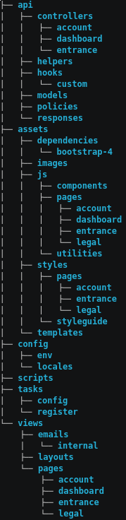
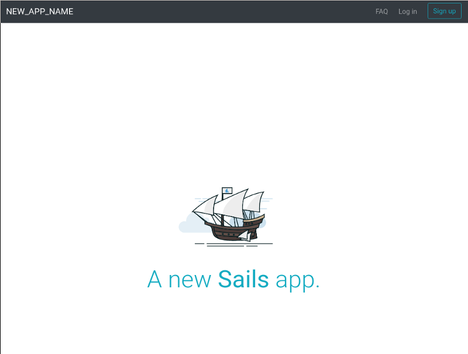

Sails.js is a [Node.js](https://nodejs.org) based web development framework that follows the [MVC](https://en.wikipedia.org/wiki/Model%E2%80%93view%E2%80%93controller) pattern, with a [convention-over-configuration](https://en.wikipedia.org/wiki/Convention_over_configuration) phylosophy. It’s been around since 2013, and I started using by around the end of that year.

Internally, Sails uses some of the modules used by [Express.js](https://expressjs.com/) as well as other modules like [Socket.io](https://socket.io/) for easying the use of [WebSockets](https://en.wikipedia.org/wiki/WebSocket).

Sails gives you a starting point and a set of rules that allows you to be much more productive and not having to take care of all the plumbing behind setting up a site from scratch, specially in Node.js.

It is an opinionated framework, that is, it makes some decisions for you while selecting the tools it offers, but most of them can be overriden if you find out that you don’t like or need this or that feature.

For the advanced develper, I will mention it provides both a [RESTful API](https://en.wikipedia.org/wiki/Representational_state_transfer) to all your routes, and you also get WebSocket access to those same routes by the use of internal virtual routing.

It also comes with a generic [ORM](https://en.wikipedia.org/wiki/Object-relational_mapping) called [Waterline](http://waterlinejs.org/) that will help you connect to your databases with ease, having [adapters](https://sailsjs.com/documentation/concepts/extending-sails/adapters) that connect to [MySQL](https://github.com/balderdashy/sails-mysql), [PostgreSQL](https://github.com/balderdashy/sails-postgresql), [MongoDB](https://github.com/balderdashy/sails-mongo), and [several others](https://sailsjs.com/documentation/concepts/extending-sails/adapters/available-adapters).

Sails.js comes with support for [EJS](http://ejs.co/) as the view templating engine, but can be changed as needed.

One of the most important changes in Sails 1.0 ([besides other things as explained by Mike McNeil here](https://gitter.im/balderdashy/sails?at=5a1d8fcd3a80a84b5b907099)) is that embraces async/await everywhere. That feature, by itself is a win-win. [Here you can find more information about what’s the deail about async/await](https://gist.github.com/mikermcneil/c1028d000cc0cc8bce995a2a82b29245).

Compared to other framework’s “star popularity” in GitHub, it sits in the “3rd place” of the most starred Node.js frameworks:

](./asset-1.png)

### OK, I’m sold! [Let’s get it started](https://www.youtube.com/watch?v=IKqV7DB8Iwg)!

Good that you ask! Alright, for starters, you have to have a Node.js development environment set up. You can follow the [official install instructions](https://nodejs.org/en/download/) or, if you want to have a little more control on what versions of Node you are running, you can use [NVM](https://github.com/creationix/nvm).

I will skip all the in-and-outs on how Node.js and it’s npm package manager, works, assuming that you already know about it. If you don’t, feel free to contact me and I can write an article about it.

For this article, I will make use of `[npx](https://medium.com/@maybekatz/introducing-npx-an-npm-package-runner-55f7d4bd282b)`, a tool that comes since npm version 5.2. So, make sure you have that version or higher. I recommend moving to version 5.6 or above, as the previous version have had several issues and bugs that might get into your way. You can easily upgrade it running `npm install npm@latest`. This tool basically allows you to run Node.js modules without having to install them globally.

The following is an asciinema of the steps taken to create a Sails App from scratch. Notice that nowadays, Sails 1 is still in beta, so, until it’s published, you will have to append `@beta` at the end of the sails module.

[**On developing your first website ever - 1 - Creating the Sails.js base app**  
_Recorded by luislobo_asciinema.org](https://asciinema.org/a/cj28TnFTJ1HU8N4poLLEmN9O0 "https://asciinema.org/a/cj28TnFTJ1HU8N4poLLEmN9O0")[](https://asciinema.org/a/cj28TnFTJ1HU8N4poLLEmN9O0)

#### Detailed Step By Step ([Ooh baby](https://www.youtube.com/watch?v=ay6GjmiJTPM)!)

These are the commands that you have to run in your terminal:

`npx sails@beta new sails-1-website --fast`

After entering this command, you are prompted to select if you want a **Web App** template or an **Empty** app. Select **1** to make use of the Sails Web App template. This creates a new directory named `sails-1-website` with the new app created in it. Finally, the `--fast` parameter tells `new` NOT to run `npm install`. I normally prefer using that option, so that I have total control of the process, just in case I want to add more modules right after creating the application.

```
npx: installed 243 in 6.707s                                                                                                                                                                     Choose a template for your new Sails app:                                                                                                                                                       1. Web App  ·  Extensible project with auth, login, & password recovery                                                                                                                         2. Empty    ·  An empty Sails app, yours to configure                                                                                                                                           (type "?" for help, or <CTRL+C> to cancel)                                                                                                                                                     ? 1                                                                                                                                                                                              info: Created a new Sails app `sails-1-website`!                                                                                                                                               (you will need to cd in and run `npm install`)
```

The next step is to see what we got after creating this app. Lets change to the sails-1-website directory:

`cd sails-1-website`

and list the contents

`ls -al`

```
total 76                                                                                                                                                                                        drwxrwxr-x 8 lobo lobo 4096 Dec 23 14:58 .                                                                                                                                                      drwxrwxr-x 6 lobo lobo 4096 Dec 23 14:58 ..                                                                                                                                                     -rw-rw-r-- 1 lobo lobo 1046 Dec 23 14:58 .editorconfig                                                                                                                                          -rw-rw-r-- 1 lobo lobo  975 Dec 23 14:58 .eslintignore                                                                                                                                          -rw-rw-r-- 1 lobo lobo 4169 Dec 23 14:58 .eslintrc                                                                                                                                              -rw-rw-r-- 1 lobo lobo 3517 Dec 23 14:58 .gitignore                                                                                                                                             -rw-rw-r-- 1 lobo lobo  709 Dec 23 14:58 .htmlhintrc                                                                                                                                            -rw-rw-r-- 1 lobo lobo  127 Dec 23 14:58 .sailsrc                                                                                                                                               -rw-rw-r-- 1 lobo lobo  669 Dec 23 14:58 Gruntfile.js                                                                                                                                           -rw-rw-r-- 1 lobo lobo 1748 Dec 23 14:58 README.md                                                                                                                                              drwxrwxr-x 8 lobo lobo 4096 Dec 23 14:58 api                                                                                                                                                    -rw-rw-r-- 1 lobo lobo 1841 Dec 23 14:58 app.js                                                                                                                                                 drwxrwxr-x 7 lobo lobo 4096 Dec 23 14:58 assets                                                                                                                                                 drwxrwxr-x 4 lobo lobo 4096 Dec 23 14:58 config                                                                                                                                                 -rw-rw-r-- 1 lobo lobo 3643 Dec 23 14:58 package.json                                                                                                                                           drwxrwxr-x 2 lobo lobo 4096 Dec 23 14:58 scripts                                                                                                                                                drwxrwxr-x 4 lobo lobo 4096 Dec 23 14:58 tasks                                                                                                                                                  drwxrwxr-x 5 lobo lobo 4096 Dec 23 14:58 views
```

So here we see a list of files and directories that comes with the Web App template. Several “dot files” for setting up [git](https://git-scm.com/), [linting](https://stackoverflow.com/questions/8503559/what-is-linting), [editor configuration](http://editorconfig.org/) and [sails](https://next.sailsjs.com/documentation/concepts/configuration/using-sailsrc-files) itself, as well as package.json and app.js, the main javascript file that is used as the entry point for the web app.

A [whole interactive documentation of the app structure](https://next.sailsjs.com/documentation/anatomy) can be checked in the Sails.js site, but I’ll provide some idea on “what is what” here, since in the last weeks some new development was done in Sails.js, adding new goodies for all of us.



The “api” directory contains all the files related to our API, that is, [controllers](https://next.sailsjs.com/documentation/concepts/actions-and-controllers), [models](https://next.sailsjs.com/documentation/concepts/models-and-orm), [helpers](https://next.sailsjs.com/documentation/concepts/helpers), [hooks](https://next.sailsjs.com/documentation/concepts/extending-sails/hooks), [policies](https://next.sailsjs.com/documentation/concepts/policies), [responses](https://next.sailsjs.com/documentation/concepts/extending-sails/custom-responses) or even [services](https://next.sailsjs.com/documentation/concepts/services) (not autocreated).

The “[assets](https://next.sailsjs.com/documentation/concepts/assets)” directory contains the images, javascript files and css files that are sent to the browser. They are not served right from that location, but from a “www” directory generated while running the app in production mode. While in development, a “.tmp” directory is generated with the files being served to the browser.

The “[config](https://next.sailsjs.com/documentation/concepts/configuration)” directory holds all the configuration around Sails, as well as a directory called “[locales](https://next.sailsjs.com/documentation/concepts/internationalization)” that contains all the “[internationalization and localization](https://en.wikipedia.org/wiki/Internationalization_and_localization)” files.

The “[scripts](https://next.sailsjs.com/documentation/concepts/shell-scripts)” directory contains scripts that can be run through Sails in the command-line.

The “tasks” folder contains a set of “grunt” tasks that take care of rebuilding the browser assets while the code is changed, building production versions of them, and other tasks like compiling ‘less’ files into ‘css’.

The “[views](https://next.sailsjs.com/documentation/concepts/views)” folder holds all the views used.

Sails.js comes with a command line tool that is used for several things: creating new apps, “lifting” (aka starting) your Sails app in development or production mode, running scripts, linting, testing, deploying, etc.

We have used the new command previously to create the sample app.

So, to start our newly created app, first we need to install the Node.js modules, as we used the `--fast` option while creating the app.

`npm install`

Finally, to start the app, we just run sails with the “lift” param

`npx sails lift`

```
info: Starting app...                                                                                                                                                                                                                                                                                                                                                                           info: Initializing hook... (`api/hooks/custom`)                                                                                                                                                 info: Initializing `apianalytics` hook...  (requests to monitored routes will be logged!)                                                                                                       info: ·• Auto-migrating...  (alter)                                                                                                                                                             info:    Hold tight, this could take a moment.                                                                                                                                                  info:  ✓ Auto-migration complete.                                                                                                                                                                                                                                                                                                                                                              debug: Running v0 bootstrap script...  (looks like this is the first time the bootstrap has run on this computer)                                                                                info:                                                                                                                                                                                           info:                .-..-.                                                                                                                                                                     info:                                                                                                                                                                                           info:    Sails              <|    .-..-.                                                                                                                                                        info:    v1.0.0-45           |\                                                                                                                                                                 info:                       /|.\                                                                                                                                                                info:                      / || \                                                                                                                                                               info:                    ,'  |'  \                                                                                                                                                              info:                 .-'.-==|/_--'                                                                                                                                                             info:                 `--'-------'                                                                                                                                                              info:    __---___--___---___--___---___--___                                                                                                                                                    info:  ____---___--___---___--___---___--___-__                                                                                                                                                 info:                                                                                                                                                                                           info: Server lifted in `/home/lobo/dev/luislobo/articles/sails-1-website`                                                                                                                       info: To shut down Sails, press <CTRL> + C at any time.                                                                                                                                         info: Read more at https://sailsjs.com/support.                                                                                                                                                                                                                                                                                                                                                debug: -------------------------------------------------------                                                                                                                                  debug: :: Fri Dec 29 2017 16:04:18 GMT-0600 (CST)                                                                                                                                                                                                                                                                                                                                               debug: Environment : development                                                                                                                                                                debug: Port        : 1337                                                                                                                                                                       debug: -------------------------------------------------------
```

After doing so, we can head to our browser and navigate to [http://localhost:1337](http://localhost:1337)



#### What perks do I get with this appplication?

A Sails 1.0 application comes preloaded with several helpers and functionallity to ease the development:

-   Actions for authentication: signup, login, recover password, confirm email
-   Account management: view/edit account, update password, update billing card
-   Contact Form
-   Helpers provided by `[sails-hook-organics](https://github.com/sailshq/sails-hook-organics)`, a hook provided by Sails with common helpers that you might need during your development: MailGun, Stripe, password hashing, Gravatar, http client, etc

In following articles I will go deep into how to customize this application.
